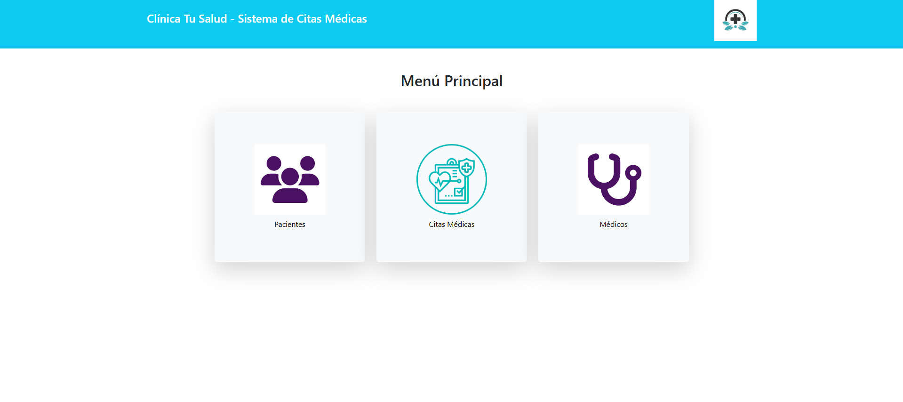

# 🩺 Sistema de Citas Médicas ASP.NET MVC

Este proyecto es una aplicación web desarrollada en Visual Studio 2022 utilizando ASP.NET MVC y SQL Server como base de datos. El sistema permite gestionar citas médicas de forma eficiente y segura mediante autenticación y control de roles.

---

## 🔑 Funcionalidades principales

- Registro y login de usuarios con validación de credenciales.
- Acceso restringido por roles (Administrador, Médico, Paciente).
- Gestión completa de citas médicas: crear, editar, eliminar y listar.
- Posibilidad de modificar información de usuarios y datos médicos.
- Interfaz amigable con validaciones de formularios en cliente y servidor.
- Conexión segura con base de datos SQL Server.
- Reportes y filtros integrados.

---

## ⚙️ Tecnologías utilizadas

- Visual Studio 2022  
- ASP.NET MVC 5  
- SQL Server  
- Entity Framework  
- Bootstrap  
- Roles personalizados con filtros `[AuthorizeRoles]`

---

## 🛠️ Instrucciones para desarrolladores

### 🔌 Requisitos previos

- Tener instalado SQL Server y Visual Studio 2022 con ASP.NET MVC.  
- Tener instalado `EntityFramework` y acceso a la consola del Administrador de Paquetes.

### 📁 Clonar este repositorio

```bash
git clone https://github.com/Eduardo1300/Citas-Medicas.git

⚙️ Configurar conexión a la base de datos

    1. Edita el archivo appsettings.json y reemplaza la cadena de conexión con tu servidor local. Ejemplo:
    "ConnectionStrings": {
  "Conexion": "Server=DESKTOP-CRJD420\\SQLEXPRESS; Database=BDClinica; Trusted_Connection=True; TrustServerCertificate=True"
}
2. Asegúrate de que en ApplicationDbContext.cs esté usando la cadena "Conexion":

optionsBuilder.UseSqlServer(Configuration.GetConnectionString("Conexion"));

3. Si necesitas regenerar los modelos desde la base de datos, puedes ejecutar el siguiente comando desde la Consola del Administrador de Paquetes de Visual Studio:
Scaffold-DbContext "Server=DESKTOP-CRJD420\SQLEXPRESS;Database=BDClinica;Trusted_Connection=True;TrustServerCertificate=True" Microsoft.EntityFrameworkCore.SqlServer -OutputDir Models -Force
Reemplaza el nombre del servidor si estás usando uno distinto.
```

📷 Capturas del sistema

A continuación se muestran las principales interfaces del sistema:





👨‍💻 Autor

Christopher Eduardo Valdivia Baca
📍 Estudiante de Computación e Informática — Cibertec Callao
🔗 LinkedIn
📧 eduardovaldivia130@outlook.es
📱 +51 953 587 619

